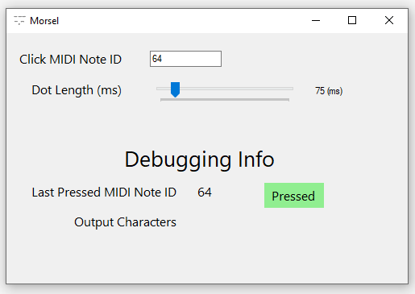

# Morsel

This winforms application lets you type characters via morse code sent through MIDI messages. Plug in a MIDI device, choose which note (such as a sustain pedal - 64) you want to listen to, and set your WPM (dot length).

Holding down the selected note for more than 6 times the dot length will type the backspace key.

| pattern | character |
|---|---|
| ..-. | f |
| -..- | x |
| .--. | p |
| - | t |
| ..--- | 2 |
| ....- | 4 |
| ----- | 0 |
| --... | 7 |
| ...- | v |
| -.-. | c |
| . | e |
| .--- | j |
| --- | o |
| -.- | k |
| ----. | 9 |
| .. | i |
| .-.. | l |
| ..... | 5 |
| ...-- | 3 |
| -.-- | y |
| -.... | 6 |
| .-- | w |
| .... | h |
| -. | n |
| .-. | r |
| -... | b |
| ---.. | 8 |
| --.. | z |
| -.. | d |
| --.- | q |
| --. | g |
| -- | m |
| ..- | u |
| .- | a |
| ... | s |
| .---- | 1 |
| .-.-.- | . |
| --..-- | , |
| ..--.. | ? |
| -.-.-- | ! |
| .----. | ' |
| -....- | - |
| -..-. | / |
| .--.-. | @ |
| -.--. | ( |
| -.--.- | ) |
| ---... | : |
| -.-.-. | ; |
